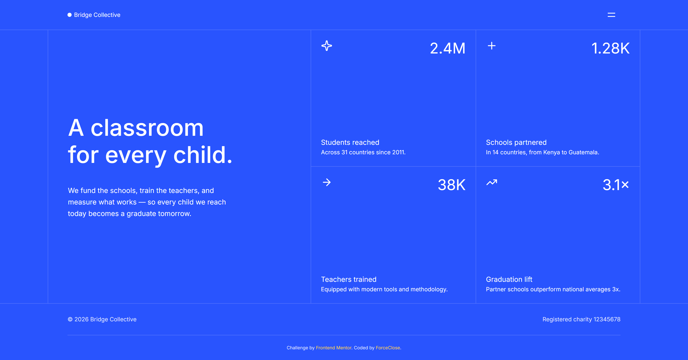

# Frontend Mentor - Time tracking dashboard solution

This is a solution to the [Time tracking dashboard challenge on Frontend Mentor](https://www.frontendmentor.io/challenges/time-tracking-dashboard-UIQ7167Jw). It features a responsive layout powered by CSS Grid and fluid typography, serverless database integration with Neon and Drizzle ORM, and client-side state management using SolidJS with TanStack Query.

## Table of contents

- [Overview](#overview)
  - [Features](#features)
  - [Screenshot](#screenshot)
  - [Links](#links)
- [My process](#my-process)
  - [Built with](#built-with)
  - [What I learned](#what-i-learned)
  - [Continued development](#continued-development)
  - [Useful resources](#useful-resources)
  - [AI Collaboration](#ai-collaboration)
- [Author](#author)

## Overview

### Features

- **Responsive Fluid Layout:** Displays an optimal layout across mobile, tablet, and desktop screens using semantic HTML5, CSS Grid, Flexbox, and fluid typography/spacing scaled with CSS `clamp()`.
- **Accessible Navigation Menu:** Built using the native HTML Popover API, enhanced with accessibility best practices (using JavaScript to trap focus with the inert attribute and dynamically update aria-expanded and aria-label).
- **Serverless Database Integration:** Retrieves statistics dynamically from **Neon** (serverless PostgreSQL database) mapped with **Drizzle ORM**.
- **Efficient Async State Management:** Implements Astro Actions for secure server-side queries and manages client-side data states (loading spinner animation, error handling, and caching) using TanStack Solid Query in SolidJS.
- **Smart Localization Formatting:** Automatically formats large numbers into compact, _reader-friendly_ representations (e.g., 2.4M and 38K) using JavaScript’s `Intl.NumberFormat`.
- **Refined Micro-interactions:** Features custom hover and focus states, including smooth underline transitions and delayed hamburger icon animations.

### Screenshot

<!-- isi screenshot -->



### Links

- Solution URL: [solution URL](https://www.frontendmentor.io/solutions/grid-landing-page-astro-solidjs-tanstack-query-neon-and-drizzle-orm-Vm9TmURF11)
- Live Site URL: [live site URL](https://grid-landing-page.forceclose.workers.dev/)

## My process

### Built with

- [Astro v7](https://astro.build) - Fullstack Framework
- [TypeScript](https://www.typescriptlang.org) - Javascript superset with static typing (built-in from astro)
- [Solidjs v1.9](https://react.dev/) - Frontend framework
- [Tailwind v4](https://tailwindcss.com/) - Utility-first CSS framework
- [Neon](https://neon.com/) - Serverless Postgres database
- [TanStack Query](https://tanstack.com/query/latest) - Data fetching library
- [Drizzle ORM v1.0.0-rc](https://orm.drizzle.team/) - Database ORM
- [Lucide](https://lucide.dev/) - Icon library

### What I learned

During this project, I gained hands-on experience bridging server-side databases with client-side reactivity, mastering asynchronous state management, resolving isomorphic rendering warnings, and optimizing user experience by preventing layout and animation flashes on initial page load:

- **Server-Side Database Querying with Drizzle ORM**

  I learned how to fetch data securely from Neon database using Drizzle ORM on the server, wrapping it inside an Astro Action to prevent exposing sensitive credentials to the client.

  ```typescript
  // src/actions/index.ts
  export const server = {
    getStats: defineAction({
      handler: async () => {
        try {
          const statsData = await db.select().from(stats);
          return statsData;
        } catch (error) {
          console.error(`Failed to retrieve data from database: ${error}`);
          throw new ActionError({
            code: "INTERNAL_SERVER_ERROR",
            message: "Failed to retrieve stats data",
          });
        }
      },
    }),
  };
  ```

- **Client-Side Data Fetching & State Management**

  I learned how to use TanStack Query in SolidJS to fetch data asynchronously from the server action. This simplified state management by automatically providing loading (`isPending`), error (`isError`), and cached success states.

  ```typescript
  // src/components/stats/Stats.tsx (simplified)
  const query = useQuery(() => ({
    queryKey: ["stats"],
    queryFn: async () => {
      const { data, error } = await actions.getStats();
      if (error) throw error;
      return data;
    },
  }));
  ```

- **Handling Isomorphic Data Fetching & SSR Warnings (`ActionCalledFromServerError`)**

  I learned that when rendering client-side framework components in Astro using `client:load`, the component is pre-rendered on the server (SSR). If the component executes an Astro Action directly inside a render-driven hook like `useQuery`, it triggers an `ActionCalledFromServerError` because Astro Actions called on the server require `Astro.callAction()`. To resolve this for client-only queries, we can change the hydration directive to `client:only="solid-js"` and utilize Astro's native `slot="fallback"` to render static skeleton cards from the server during page load.

- **Preventing FOUC (Flash of Un-animated Content)**

  Elements are pre-rendered on the server and painted instantly by the browser. However, when client-side animation engines (like GSAP) manipulate their initial state (e.g., opacity or translate), a brief "flash" of the final content occurs before JavaScript loads. To fix this, I implemented a progressive enhancement approach using a lightweight inline script in the layout `<head>` and a custom Tailwind CSS v4 `@utility`:

  ```html
  <!-- Layout.astro -->
  <script is:inline>
    document.documentElement.classList.add("animate-init");
  </script>
  ```

  ```css
  /* global.css */
  @utility animate-target {
    .animate-init & {
      @apply opacity-0;
    }
  }
  ```

  This ensures that elements are only hidden on load if JavaScript is active, preventing FOUC while keeping content accessible for SEO crawlers and users with JS disabled.

### Continued development

For the next stages of this project, I plan to focus on improving the user experience, adding interactive database mutations, and polishing UI animations:

- **Database Mutations**: Add an interface/form to input new statistics, using Astro Actions alongside TanStack Query's mutations to dynamically write data back to the Neon PostgreSQL database.
- **Real-Time Data Polling**: Configure TanStack Query to automatically refetch data at set intervals to simulate live, real-time metrics.

### Useful resources

- [TinyPNG](https://tinypng.com/) - Helped me compress and optimize the images in the project without losing quality, making the page load faster.
- [Cloudinary](https://cloudinary.com/) - Used to host the Open Graph and Twitter card images for social media sharing.
- [Perfect Pixel](https://chrome.google.com/webstore/detail/perfectpixel-by-welldonec/dkaagdgjlophiddqccjgplachon0304v) - Chrome extension that allowed me to overlay the design mockup directly on my live page for pixel-perfect accuracy.
- [Fontsource](https://fontsource.org/) - This made self-hosting fonts incredibly easy. I simply installed the font package via npm and imported it directly into my JS file, eliminating the hassle of managing font files manually or relying on external CDNs.
- [Fluid Typography Calculator](https://royalfig.github.io/fluid-typography-calculator/) - A helpful tool for calculating responsive font sizes using CSS clamp(), which makes it easy to generate fluid text sizing that adapts smoothly between screen widths.

### AI Collaboration

This project was developed with the assistance of an AI coding partner (Antigravity by Google DeepMind) to streamline feature development, discuss code structure, solve technical challenges, debug runtime server-client warnings, and compose documentation.

**How I used it:**

- **Database Seeding (`src/db/seed.ts`)**: The AI helped write the database seed script using Drizzle ORM to efficiently insert the initial statistical dashboard data (such as student, school, and teacher statistics) into the Neon PostgreSQL database.
- **`classList` Utility (`src/utils/class-list.ts`)**: The AI assisted in designing a lightweight custom `classList` helper function to handle conditional and dynamic class names cleanly, without relying on external libraries like `clsx`.
- **README Documentation (`README.md`)**: The AI assisted in structuring, drafting, and updating the project's documentation, including listing features, summarizing setup processes, and logging code architectures.
- **Debugging SSR & Hydration (`ActionCalledFromServerError`)**: The AI assisted in diagnosing the Astro Actions server-rendering error and subsequent hydration crashes. We implemented a fix by changing client directive from `client:load` to `client:only` paired with Astro's native `slot="fallback"`.

This collaboration made it easier to manage utility functions, configure backend databases, troubleshoot complex isomorphic rendering boundaries, and maintain comprehensive project documentation.

## Author

- GitHub - [Force Close](https://github.com/forceclosee)
- Frontend Mentor - [@forceclosee](https://www.frontendmentor.io/profile/forceclosee)
- X - [@forceclosee](https://x.com/forceclosee)
